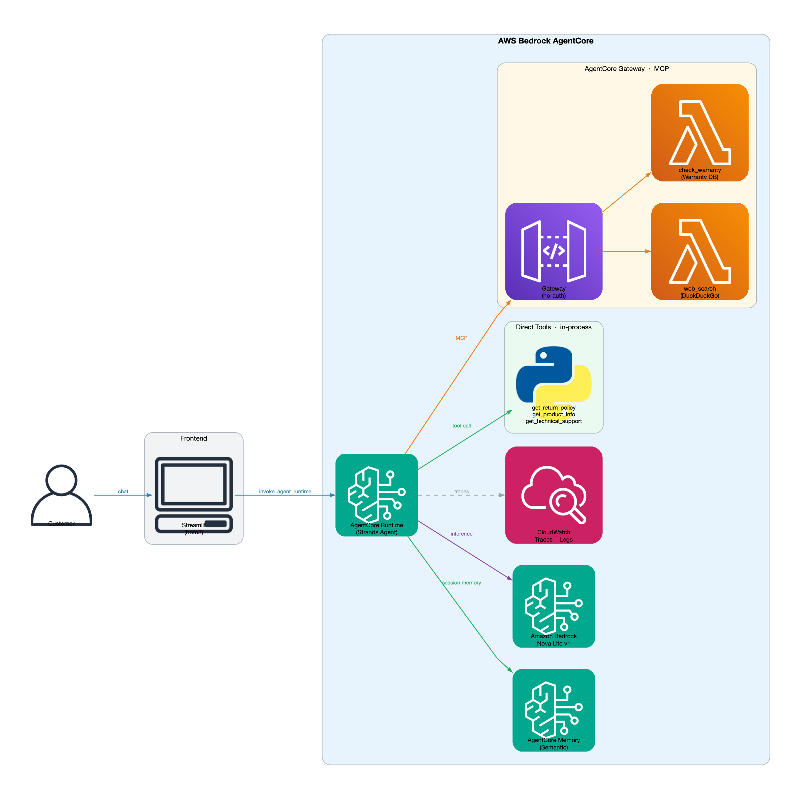

# ShopEasy Customer Support Agent

AI-powered e-commerce customer support built on **AWS Bedrock AgentCore** with a Streamlit frontend.

## Architecture



<details>
<summary>Text version</summary>

```
User → Streamlit App → AgentCore Runtime (Strands Agent)
                              │
               ┌──────────────┼──────────────┐
               │              │              │
         Tools 1-3        AgentCore      AgentCore
         (direct)          Memory         Gateway
    get_return_policy   (sessions +    (MCP server)
    get_product_info     history)           │
    get_technical_support                  ├── Tool 4: web_search (Lambda)
                                           └── Tool 5: check_warranty (Lambda)
```

</details>

### AgentCore Services Used

| Service | Role |
|---|---|
| **AgentCore Runtime** | Hosts the Strands agent as a managed HTTP service |
| **AgentCore Memory** | Semantic memory across sessions (per user) |
| **AgentCore Gateway** | MCP server routing Lambda-backed tools |
| **AgentCore Observability** | Automatic traces → CloudWatch |

### Tools

| # | Tool | Location | Backend |
|---|---|---|---|
| 1 | `get_return_policy` | Runtime (direct) | In-process |
| 2 | `get_product_info` | Runtime (direct) | In-process |
| 3 | `get_technical_support` | Runtime (direct) | In-process |
| 4 | `web_search` | Gateway → Lambda | DuckDuckGo |
| 5 | `check_warranty` | Gateway → Lambda | Mock warranty DB |

## Getting Started

### 1. Prerequisites

Make sure the following are installed before you begin:

| Tool | Version | Notes |
|---|---|---|
| Python | 3.11+ | |
| [uv](https://docs.astral.sh/uv/) | latest | Python package manager |
| AWS CLI | v2 | [Install guide](https://docs.aws.amazon.com/cli/latest/userguide/install-cliv2.html) |
| Node.js | 20+ | Only for Option B (AgentCore CLI) |

You also need:
- An **AWS account** with Bedrock model access enabled for `us.amazon.nova-lite-v1:0` in `us-west-2`
- AWS credentials configured (`aws configure` or IAM role)

### 2. Clone the repository

```bash
git clone https://github.com/Sunilrana1978/customer-support-agent.git
cd customer-support-agent
```

### 3. Set up the Python environment

```bash
# Install uv (skip if already installed)
curl -LsSf https://astral.sh/uv/install.sh | sh

# Create a virtual environment with Python 3.11
uv venv --python 3.11

# Activate it
source .venv/bin/activate        # macOS / Linux
# .venv\Scripts\activate         # Windows

# Install all dependencies
uv pip install -r requirements.txt
```

### 4. Configure AWS credentials

```bash
aws configure
# Prompts for: AWS Access Key ID, Secret Access Key, region (us-west-2), output format
```

Verify access:

```bash
aws sts get-caller-identity
aws bedrock list-foundation-models --region us-west-2 --query 'modelSummaries[?modelId==`amazon.nova-lite-v1:0`]'
```

### 5. Deploy to AWS

See the [Deployment](#deployment) section below. Once deployed, the script prints a `RuntimeArn`.

### 6. Run the Streamlit app

```bash
export AGENTCORE_RUNTIME_ARN=<RuntimeArn from deployment output>
streamlit run streamlit_app/app.py
```

Open [http://localhost:8501](http://localhost:8501) in your browser.

---

## Project Structure

```
customer-support-agent/
├── agentcore/
│   ├── agentcore.json          # AgentCore project config (Runtime, Memory, Gateway)
│   └── aws-targets.json        # AWS account + region
├── app/
│   └── CustomerSupportAgent/
│       ├── main.py             # Agent entrypoint (@app.entrypoint)
│       ├── tools.py            # Direct tools 1-3 (Strands @tool)
│       ├── memory/
│       │   └── session.py      # AgentCoreMemorySessionManager setup
│       └── pyproject.toml      # Agent Python dependencies
├── lambda/
│   ├── web_search/
│   │   ├── handler.py          # DuckDuckGo search Lambda
│   │   ├── tools.json          # MCP tool schema for Gateway
│   │   └── requirements.txt
│   └── check_warranty/
│       ├── handler.py          # Warranty lookup Lambda
│       ├── tools.json          # MCP tool schema for Gateway
│       └── requirements.txt
├── streamlit_app/
│   ├── app.py                  # Streamlit chat UI
│   └── requirements.txt
├── infrastructure/
│   ├── cloudformation.yaml     # Full stack definition (Runtime, Memory, Gateway, Lambdas)
│   └── deploy_lambdas.py       # Deploy Lambda functions via boto3 (CLI path only)
└── scripts/
    ├── package_and_deploy_cfn.sh  # CloudFormation deploy (Option A)
    └── deploy.sh                  # AgentCore CLI deploy (Option B)
```

## Deployment

### Option A — CloudFormation (recommended)

Packages all artifacts, uploads to S3, and deploys the full stack in one script. No Node.js required.

```bash
bash scripts/package_and_deploy_cfn.sh
```

The script:
1. Creates the S3 artifact bucket (`shopeasy-agentcore-artifacts-<account>-us-west-2`) if needed
2. Packages the agent code with ARM64-compatible wheels and uploads to S3
3. Packages each Lambda function (x86_64) and uploads to S3
4. Deploys (or updates) the `shopeasy-customer-support-agent` CloudFormation stack
5. Prints the Runtime ARN, Gateway URL, and Memory ID on completion

First deploy takes ~10 minutes. Re-run the same script to update after code changes (idempotent).

### Option B — AgentCore CLI

```bash
# 1. Install AgentCore CLI
npm install -g @aws/agentcore

# 2. Update your account ID
export ACCOUNT_ID=$(aws sts get-caller-identity --query Account --output text)
sed -i "s/REPLACE_WITH_YOUR_ACCOUNT_ID/$ACCOUNT_ID/" agentcore/aws-targets.json

# 3. Deploy Lambda functions
python3 infrastructure/deploy_lambdas.py

# 4. Add Lambda targets to the Gateway (use ARNs printed in step 3)
agentcore add gateway-target \
  --name WebSearchTarget \
  --type lambda-function-arn \
  --lambda-arn <WEB_SEARCH_ARN> \
  --tool-schema-file lambda/web_search/tools.json \
  --gateway CustomerSupportGateway

agentcore add gateway-target \
  --name CheckWarrantyTarget \
  --type lambda-function-arn \
  --lambda-arn <CHECK_WARRANTY_ARN> \
  --tool-schema-file lambda/check_warranty/tools.json \
  --gateway CustomerSupportGateway

# 5. Deploy everything (Runtime + Memory + Gateway) — takes ~5-10 min
agentcore deploy

# 6. Check status and get Runtime ARN
agentcore status
```

## Local Development (without AWS)

To iterate on the agent logic without a full cloud deployment:

```bash
# Start local dev server on :8080 (requires AgentCore CLI)
agentcore dev

# In a second terminal, send a test request
curl -X POST http://localhost:8080/invocations \
  -H "Content-Type: application/json" \
  -d '{"prompt": "What is the return policy for electronics?"}'
```

Only the 3 direct tools are available locally. Memory and Gateway tools are silently skipped when `MEMORY_CUSTOMERSUPPORTMEMORY_ID` and `AGENTCORE_GATEWAY_URL` are unset.

## Useful CLI Commands (Option B)

```bash
agentcore status          # View deployed resources and ARNs
agentcore invoke "Hello"  # Quick test of the deployed agent
agentcore logs            # Stream runtime logs
agentcore traces list     # View observability traces
agentcore deploy          # Redeploy after code changes
```

## Teardown

### CloudFormation (Option A)

```bash
aws cloudformation delete-stack --stack-name shopeasy-customer-support-agent
aws cloudformation wait stack-delete-complete --stack-name shopeasy-customer-support-agent

# Empty and delete the artifact bucket
aws s3 rm s3://shopeasy-agentcore-artifacts-<account>-us-west-2 --recursive
aws s3api delete-bucket --bucket shopeasy-agentcore-artifacts-<account>-us-west-2
```

### AgentCore CLI (Option B)

```bash
agentcore remove all

# Also delete the Lambda functions
aws lambda delete-function --function-name agentcore-web-search
aws lambda delete-function --function-name agentcore-check-warranty
```

## Known Deployment Constraints

These apply to the CloudFormation path and are not obvious from the AWS docs:

- **Resource name patterns**: `AgentRuntimeName`, Memory `Name`, and `RuntimeEndpoint` `Name` must match `^[a-zA-Z][a-zA-Z0-9_]{0,47}$` — no hyphens, 48 chars max. Use underscores.
- **GatewayTarget always requires `CredentialProviderConfigurations`** even when `AuthorizerType: NONE`. Set `CredentialProviderType: GATEWAY_IAM_ROLE`.
- **Agent zip must not contain `.pyc` files** — the Runtime rejects bytecode cache. The packaging script uses `--no-compile` and excludes `*.pyc`.
- **S3Location uses `Prefix`, not `Key`** — the `AgentRuntimeArtifact` S3 field is named `Prefix`.
- **Stack stuck in `REVIEW_IN_PROGRESS`** (failed changeset, no resources created) must be deleted before redeploying.
